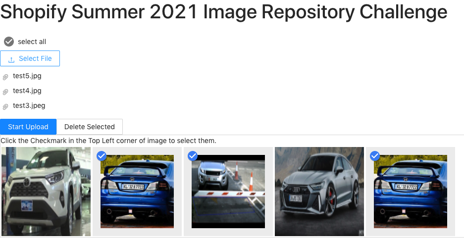

# Shopify_Image_Repo_Summer_2021

# Implemented Functionalities

1. You can add one or many images to the repository.

2. You can select images to delete.

The images are stored in an Amazon S3 bucket with their reference location stored in a MySQL db hosted on Amazon RDB. Repo can support adding images of the same name because each image is tagged with a UUID.



# How to Run

1. Go to the following [link](https://docs.google.com/document/d/1zZ5_eALQw6shdA4u0U7wRMbnGW8Bhl2rWDruE6T-E6M/edit?usp=sharing) to download the .env file. Place the .env file in the root directory. Make sure the file is called `.env`. If the link doesn't work, please send me an email at `wy2wen@uwaterloo.ca` and I will send you the .env file.
2. In the root directory, run `yarn` to install all dependencies.
3. Next run `pip install -r app/requirements.txt`
4. To run the frontend, run `yarn start` (in root directory).
5. To run the backend, run `yarn start-api` (in root directory).

# Endpoint Documentation

## GET /api
Returns a welcome message.

### Sample Response
```
"Welcome to the Shopify Image Repo API!"
```

## GET /api/display
Display a list of images and relevant information.

### Sample Response
```
{
    "display_list": [
        {
            "file_ext": ".jpg",
            "file_name": "test2.jpg",
            "key": "1d149dda-7ede-4ce7-a497-7b323011ceaf",
            "url": "http://img-repo-bucket.s3.amazonaws.com/"
        },
        {
            "file_ext": ".jpeg",
            "file_name": "test3.jpeg",
            "key": "20e6865e-6bf1-402c-8346-eda6e75d43c1",
            "url": "http://img-repo-bucket.s3.amazonaws.com/"
        }
    ]
}
```

## POST /api/upload
Posts a list of images to the repository.

### Sample Input
```
{
    "imgFiles[]": <File1>,
    "imgFiles[]": <File2>
}
```

### Sample Response
```
{
    "added_items": [
        {
            "file_ext": ".jpeg",
            "file_name": "test3.jpeg",
            "key": "c0afc36a-773a-4a33-a8c6-b081d00be9a8",
            "url": "http://img-repo-bucket.s3.amazonaws.com/"
        },
        {
            "file_ext": ".png",
            "file_name": "test4.jpeg",
            "key": "96cb86d0-3432-4be3-ae0d-cc69c4519753",
            "url": "http://img-repo-bucket.s3.amazonaws.com/"
        }
    ]
}
```

## DELETE /api/delete
Deletes selected images

### Sample Input
```
{
    "img_id_list": ["db2d0939-7eda-47b7-8fc3-8e7f0928db68", "c0afc36a-773a-4a33-a8c6-b081d00be9a8"]
}
```

### Sample Output
```
{
    "deleted_keys": [
        "c0afc36a-773a-4a33-a8c6-b081d00be9a8",
        "db2d0939-7eda-47b7-8fc3-8e7f0928db68"
    ]
}
```